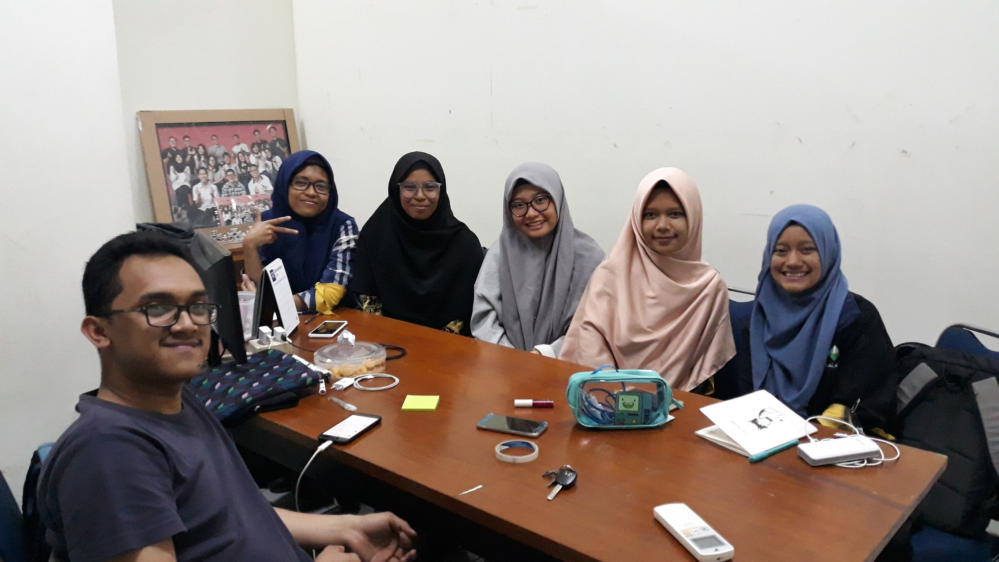

# Wawancara Kak Faiz

Pada hari Kamis, 22 Agustus 2019 pukul 19:00 di lab RPL Labtek V saya (Yuni), Ferdina, Sulis, Hasna, dan Shofu melakukan wawancara dengan salah satu Daemon yaitu Kak Faiz.

# Biodata Kak Faiz

Nama lengkapnya Ahmad Faiz Sahupala, panggilannya Faiz (13516065) Teknik Informatika angkatan 2016. Di HMIF ITB sekarang dia seorang Sekretaris Jenderal, katanya dia milih jadi Sekjen HMIF karena dia ingin mengubah beberapa hal yang perlu diubah seperti mengubah visi dan misi HMIF tetapi tidak dengan menjadi kahim. Menurut Kak Faiz sendiri itu sebenarnya tugas seorang kahim, lalu kenapa tidak jadi kahim aja? Jawabannya karena Kak Faiz ga mau ikut hiring. Lalu, dengan menjadi sekjen dia ingin mensupport semua fraksi yang ada dalam HMIF ITB. Proker khusus di kesekjenan katanya tidak ada itu dikarenakan Kak Faiz sebagai sekjen memberikan support secara teknik pengarsipan, pengadministrasian, bikin timeline, dan ikut memimpin rapat juga kalau kahim tidak bisa memimpin. Lalu, apa bedanya kahim dan sekjen di HMIF ITB? Kata Kak Faiz kahim adalah seorang pemimpin, sedangkan sekjen adalah seorang eksekutor yang merumuskan mimpi-mimpi yang ingin diwujudkan oleh seorang kahim. Di Arkavidia Kak Faiz juga memegang peran sebagai Sekretaris Jenderal. Konon katanya yang jadi sekjen di HMIF bakalan jadi sekjen juga di Arkavidia.

# Pertanyaan Bebas

Hal yang paling beruntung ketika Kak Faiz masuk ke HMIF adalah bertemu dengan orang-orangnya. Menurutnya, anak HMIF ITB itu punya pola pikir yang berbeda dari anak himpunan lain. Katanya kalau lagi ngumpul atau hiring bareng anak himpunan lain keliatan banget kalo pola pikir anak HMIF sistematis dan terstruktur. Selain itu anak HMIF juga mempunyai jiwa kompetitif yang bagus dan sehat. Kalau mau ikut lomba itu tidak sesusah jurusan lain, anak HMIF paling tidak hanya butuh resource laptop untuk eksplorasi.

Melihat bagaimana orang-orang melihat IT, mungkin ada pola pikir bahwa IT itu hanya bisa diraih oleh kalangan bawah terutama di negara kita yang mayoritas penduduknya menengah ke bawah. Menurut Kak Faiz itu tidak benar. Seharusnya dengan adanya IT yang canggih sekarang ini harusnya orang-orang kalangan bawah harus bisa diraih dan dirangkul. Seperti yang Gojek lakukan. Siapa sangka dulu akan ada ojek yang bisa dipesan melalui aplikasi ponsel? Pendekatannya ke masyarakat dapat dilakukan dengan memberikan penyuluhan kepada masyarakat, dari sekian masyarakat menengah ke bawah kita tenaga IT dapat memberikan penyuluhan kepada beberapa orang dulu. Bagaimana orang tersebut bisa menggunakan ponsel pintar, kemudian bagaimana dia bisa menggunakan aplikasinya, lalu bagaimana dia bisa memanfaatkan motor sebagai salah satu ladang pekerjaan mereka dengan bantuan Gojek. Kemudian bila berhasil, seharusnya beberapa orang yang telah diberi bekal tadi akan mentrigger masyarakat yang lain bahwa ternyata dengan IT mereka bisa mendapatkan penghasilan dengan itu mereka akan mulai mencoba untuk melakukan hal yang sama. Semua hal yang IT berikan tidak melulu dalam bentuk 'produk' jadi, kita bisa saja membuat environtment untuk masyarakat menengha ke bawah dengan melakukan penetrasi dengan memperlihatkan bahwa banyak hal yang dapat dilakukan dengan IT.

Note: Saya sangat berkesan dengan jawaban Kak Faiz mengenai hal konkrit apa yang bisa IT berikan kepada masyarakat menengah ke bawah, ternyata yang IT berikan tidak hanya berupa produk instan yang langsung jadi, semuanya juga butuh skill bersosial agar masyarakat dapat menerima bahwa ada banyak hal yang IT berikan kepada kita untuk memudahkan hidup. Karena pada dasarnya yang menggunakan produk IT adalah masyarakat dan akan lebih baik lagi bila itu bermanfaat.